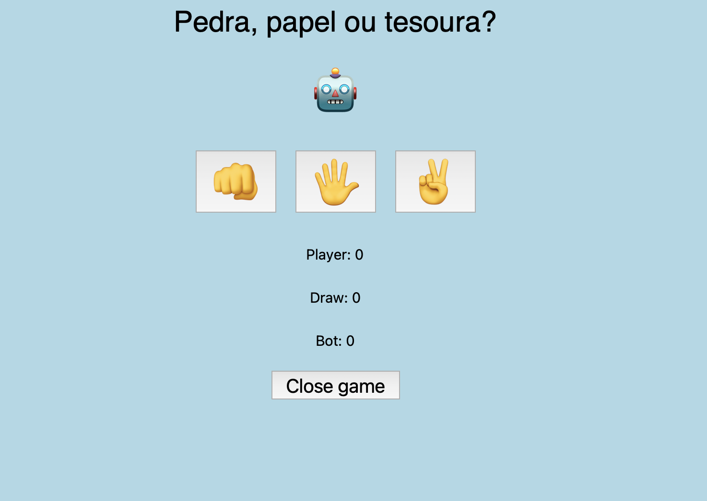
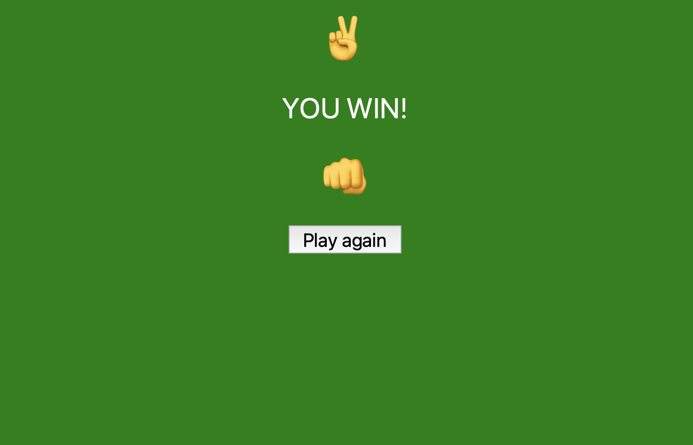
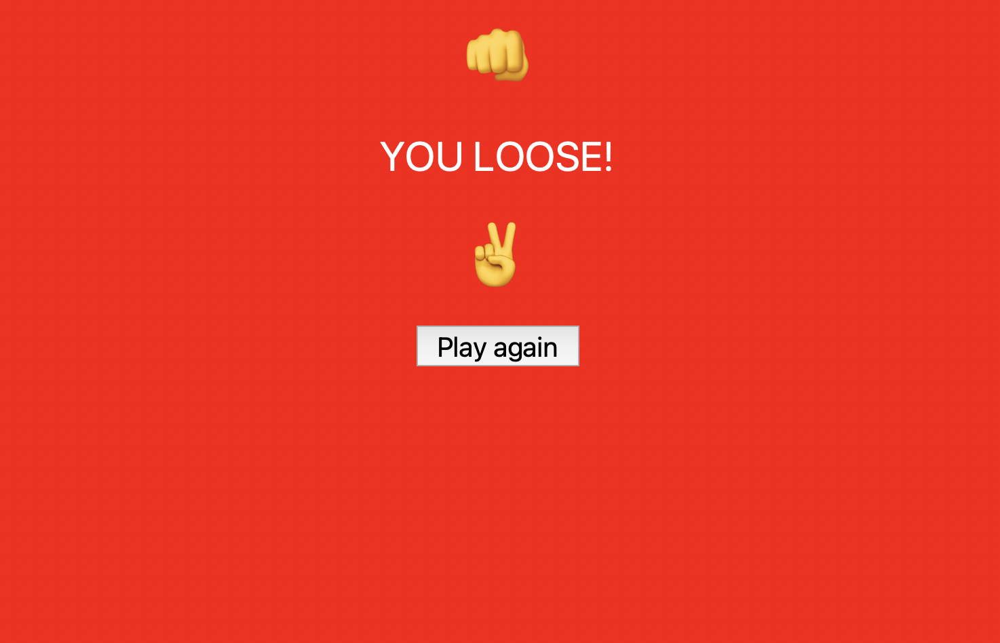
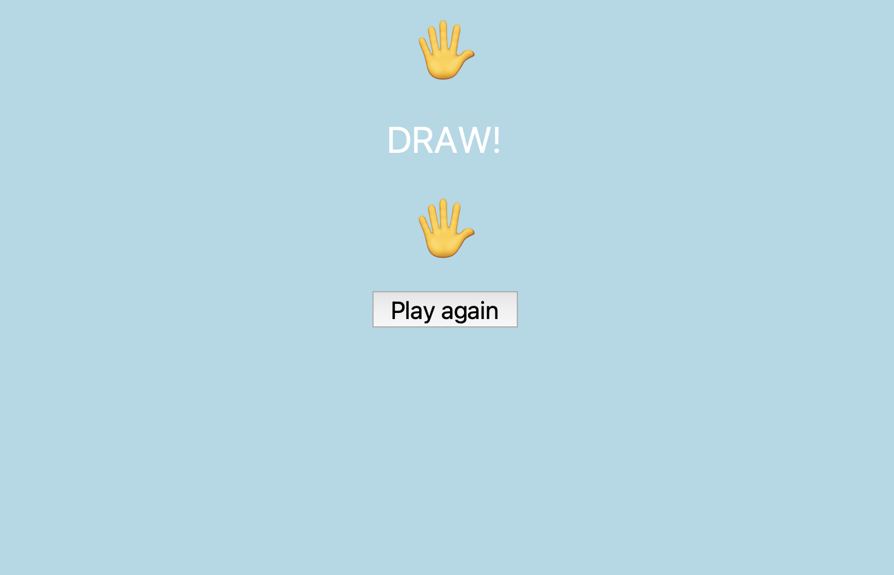

# Jokenpo em Python

Português

Um jogo simples de pedra, papel, tesoura em Python

Usando as bibliotecas Tkinter, Emoji e Random, criei um jogo de Pedra Papel e Tesoura em Python, onde você pode jogar contra o computador (bot).

Dando início ao jogo:
Após rodar o código, uma janela Tkinter é aberta, e você pode começar o jogo.
A presença dos emojis gera um visual mais atrativo para o game, com os sinais da mão representando as suas escolhas dentro do jogo (pedra, papel ou tesoura) e o robô o seu adversário, o bot.

Após fazer sua escolha, uma outra janela Tkinter é aberta com o resultado da partida, mostrando a opção do bot, a sua, e uma mensagem de vitória, empate ou derrota.

As mensagens de resultado acompanham uma cor na tela para gerar um visual mais atrativo, sendo:
    • 'You win' em verde (vitória do jogador)
    • 'You loose' em vermelho (vitória do bot)
    • 'Draw' em azul claro (empate)

Na tela de resultados, tem um botão intitulado 'Play Again', onde, ao clicar, você é direcionado novamente para a tela inicial para uma nova partida.

Ao voltar a tela inicial, há uma contagem de pontos, seja para o jogador ('Player'), para o bot ('Bot'), ou para empates ('Draw').

Sempre que uma nova partida é iniciada, há um acumulo de pontos referente ao vencedor da partida anterior. Caso haja empate, um novo ponto é adicionado na contagem 'Draw'.

O jogador pode fechar o jogo quando quiser clicando no botão 'Close game', na janela principal.

Sobre as bibliotecas:
    • Tkinter: Usada para criação das janelas para o jogo. Com ela, é possível criar aplicações com interfaces gráficas. A partir dela são criados os botões e comandos do jogo.
    • Emoji: Uma biblioteca simples que permite a utilização de emojis dentro do código. Gera uma visual mais atrativo no código, prezando por uma estética 'divertida'.
    • Random: Utilizada para randomizar as escolhar do bot dentro do jogo. Dessa forma, durante as rodadas o bot poderá randomizar suas escolhas dentro das opções disponíveis (pedra, papel, tesoura). Uma forma simples de promover um jogo versus contra o computador, de forma justa.

Página inicial do jogo:

Jogador vence:

Jogador perde:

Empate:

English

A simple Rock, Paper, Scissors game in Python

Using the Tkinter, Emoji, and Random libraries, I created a Rock, Paper, Scissors game in Python where you can play against the computer (bot).

Starting the game: After running the code, a Tkinter window opens, and you can start the game. The presence of emojis creates a more attractive visual for the game, with hand signs representing your choices in the game (rock, paper, or scissors) and the robot representing your opponent, the bot.

After making your choice, another Tkinter window opens with the result of the match, showing the bot’s choice, yours, and a message of win, draw, or loss.

The result messages are accompanied by a color on the screen to make the game more visually appealing:

	•	‘You win’ in green (player victory)
	•	‘You lose’ in red (bot victory)
	•	‘Draw’ in light blue (tie)

On the results screen, there is a button labeled ‘Play Again,’ which, when clicked, redirects you back to the main screen for a new match.

Returning to the main screen, there is a score counter for the player (‘Player’), for the bot (‘Bot’), or for draws (‘Draw’).

Each time a new game is started, points are accumulated based on the winner of the previous match. In case of a tie, a new point is added to the ‘Draw’ count.

The player can close the game at any time by clicking the ‘Close game’ button on the main window.

About the libraries:

	•	Tkinter: Used to create the windows for the game. It allows creating applications with graphical interfaces. Through it, the buttons and commands of the game are created.
	•	Emoji: A simple library that allows the use of emojis in the code. It makes the code more visually appealing, ensuring a ‘fun’ aesthetic.
	•	Random: Used to randomize the bot’s choices in the game. This way, during the rounds, the bot can randomize its choices among the available options (rock, paper, scissors). A simple way to promote a fair game against the computer.

